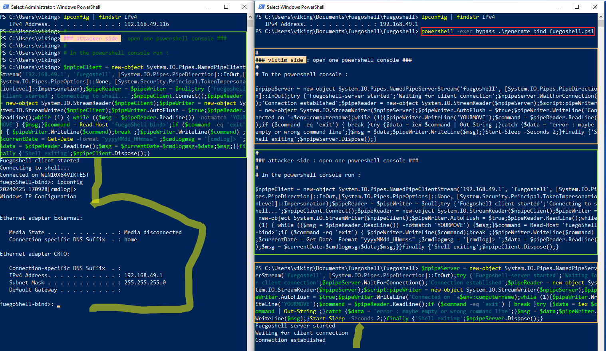

# About Fuegoshell
All details are available on <https://v1k1ngfr.github.io/fuegoshell/>  


`Fuegoshell` could be useful when your Remote Code Execution or data exfiltration require bypassing some restrictions (firewalls) or detections (EDR). It's more a trick than a tool but it provides a PS1 script for generating Powershell oneliners. Those shells (bind or reverse) are focusing on :  

- no local admin privilege required
- no need to Bind() / listen on a new server local port, re-use of TCP 445
- use of named pipes for sending commands / receiving results
- keep it simple using Powershell oneliners for all this stuff  


# Creating a "fuegoshell" bind shell

Here is an example below of running in "bind" mode.  

```
powershell -exec bypass .\generate_bind_fuegoshell.ps1 
```  



# Creating a "fuegoshell" reverse shell  

Here is an example below of running in "reverse" mode.  

```
powershell -exec bypass .\generate_reverse_fuegoshell.ps1 
```  


